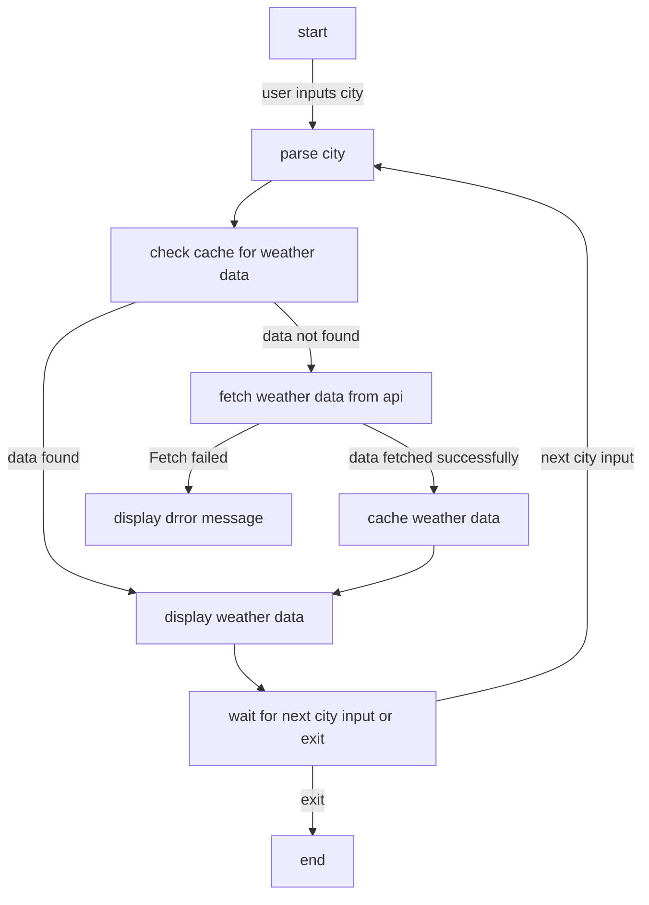

# WeAt: The wheather from the whole world really quickly!

## Overview

**WeAt** is a weather information _cli_ designed to provide real-time data for cities worldwide.In here we find accurate weather forecasts, easing your planning and decision-making for traveling process.

## Features

**Global Weather Data**: access weather information for cities across the globe.
**Interactive CLI**: easy-to-use command-line interface for quick weather data retrieval.

## Using WeAt

### Once the application is running:

1. **Enter the name of the city (e.g., Porto Alegre)**

2. **View the displayed weather information, including temperature, humidity, wind speed, and more**

3. **To exit, simply type exit**

## Setup and running

### Steps to run

1. **Build with Docker**:

   ```bash
   docker compose build 
   ```

3. **Run the bash inside the container**:

   ```bash
   docker compose run we_at ash 
   ```   

4. **And simply source this script**:

   ```bash
   source ./we_at.sh
   ```      

## Graphic representation



## Expects

```bash
Welcome to WeAt!
 The wheather from the whole world really quickly!
Enter the name of a city to get weather information (or type 'exit' to quit):
> porto alegre
Weather data for Porto Alegre:
  Coordinates: Latitude -30.0331, Longitude -51.23
  Weather: broken clouds
  Temperature: 24.78°C
  Feels like: 25.77°C
  Pressure: 1006 hPa
  Humidity: 94%%
  Wind Speed: 5.14 m/s
  Cloudiness: 75%%
  Sunrise: 2023-12-25 05:22:30Z
  Sunset: 2023-12-25 19:27:03Z
Enter the name of a city to get weather information (or type 'exit' to quit):
> tokyo
Weather data for Tokyo:
  Coordinates: Latitude 35.6895, Longitude 139.6917
  Weather: clear sky
  Temperature: 4.56°C
  Feels like: 2.79°C
  Pressure: 1020 hPa
  Humidity: 54%%
  Wind Speed: 2.06 m/s
  Cloudiness: 0%%
  Sunrise: 2023-12-26 06:49:02Z
  Sunset: 2023-12-26 16:33:35Z
Enter the name of a city to get weather information (or type 'exit' to quit):
> 
```